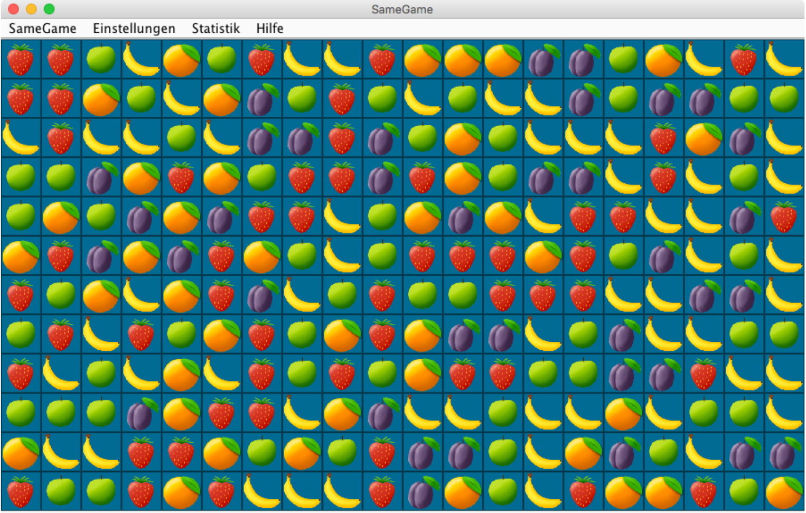

# SameGame in Java
This is SameGame, a popular game in which you need to try to remove all tiles on a board while collecting most points

You remove the tiles by clicking on adjacent tiles with the same colour

# Programme itself
The programme was written by my as a school child. It is still working, but the programme code is partly in German. Its tested and still runs on newer operation systems.

# Rules
You can click on a tile if at least one of the adjacent four tiles has the same colour. Clicking on it removes all adjacent tiles recursively. Every tile above will fall down, if there are empty columns, everything will move to the left. You get more points if you remove big structures.

# Points
The number of points for each operation is `0.4*n*n + n` where `n` is the number of tiles removed. The theoretically highest point sum is 23,280 points for all 240 tiles in the same colour.

An alternative motivation is to try to remove all tiles from the board instead of collecting the most points.
